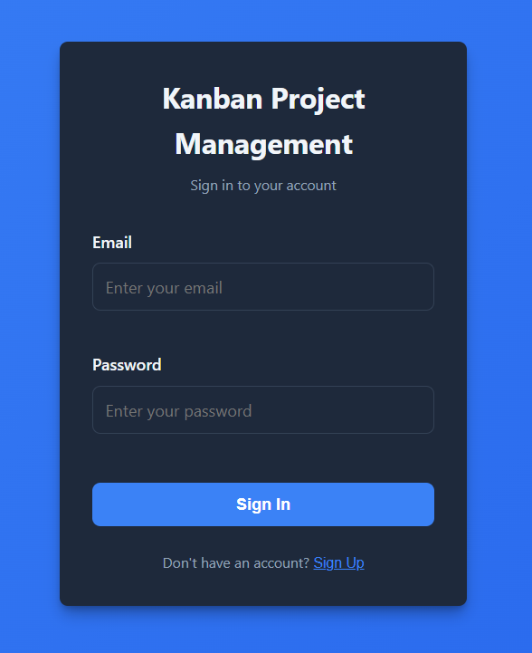
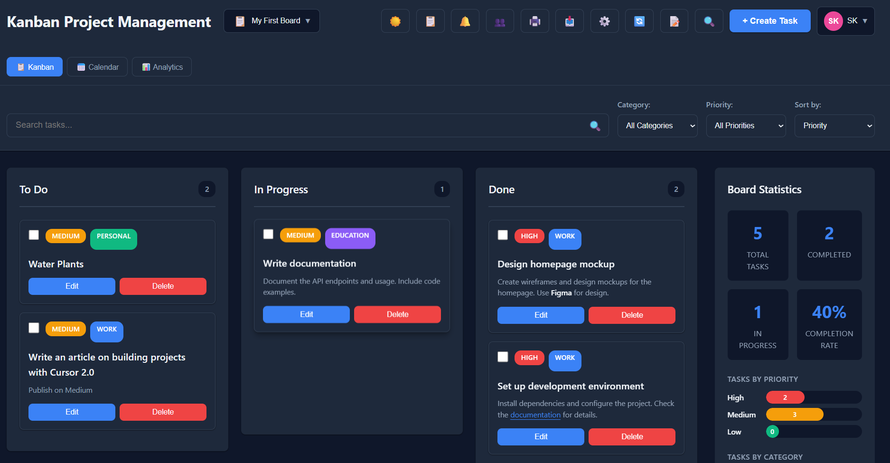
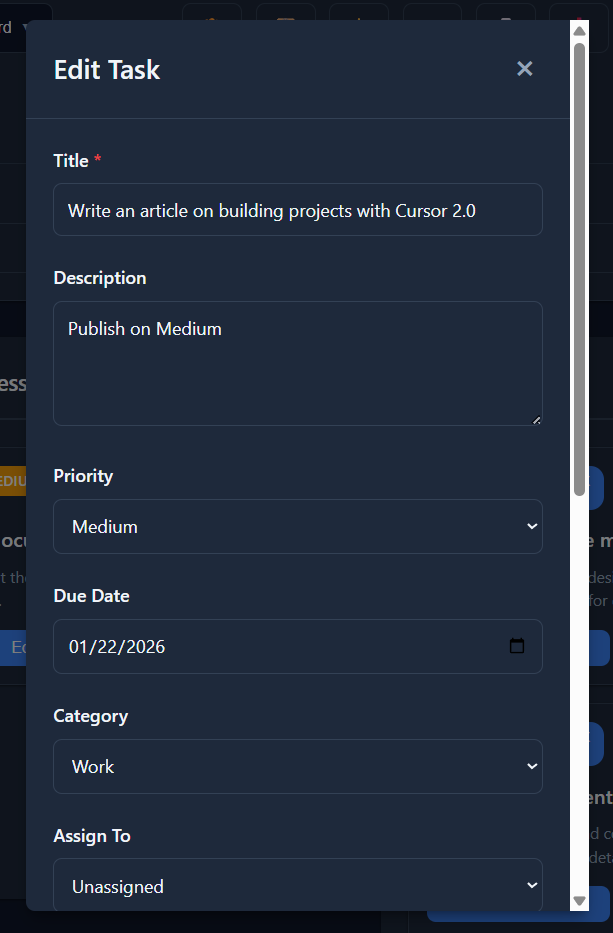
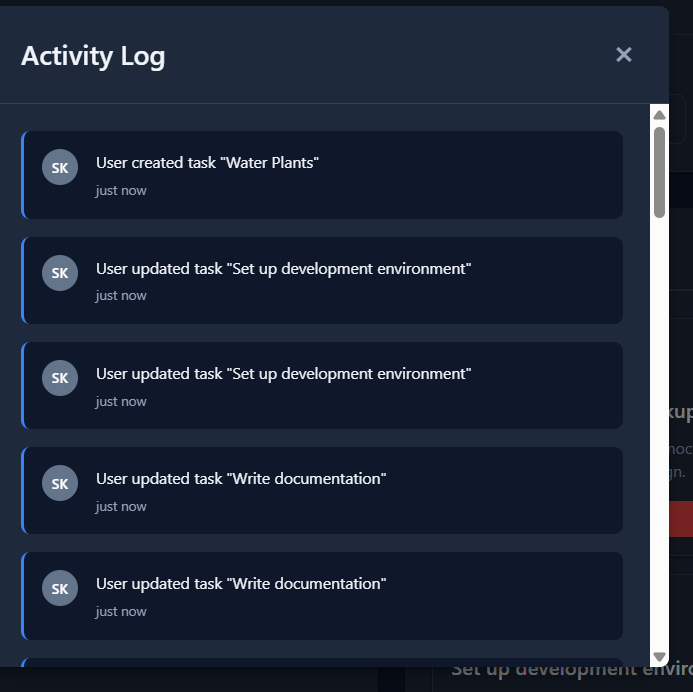
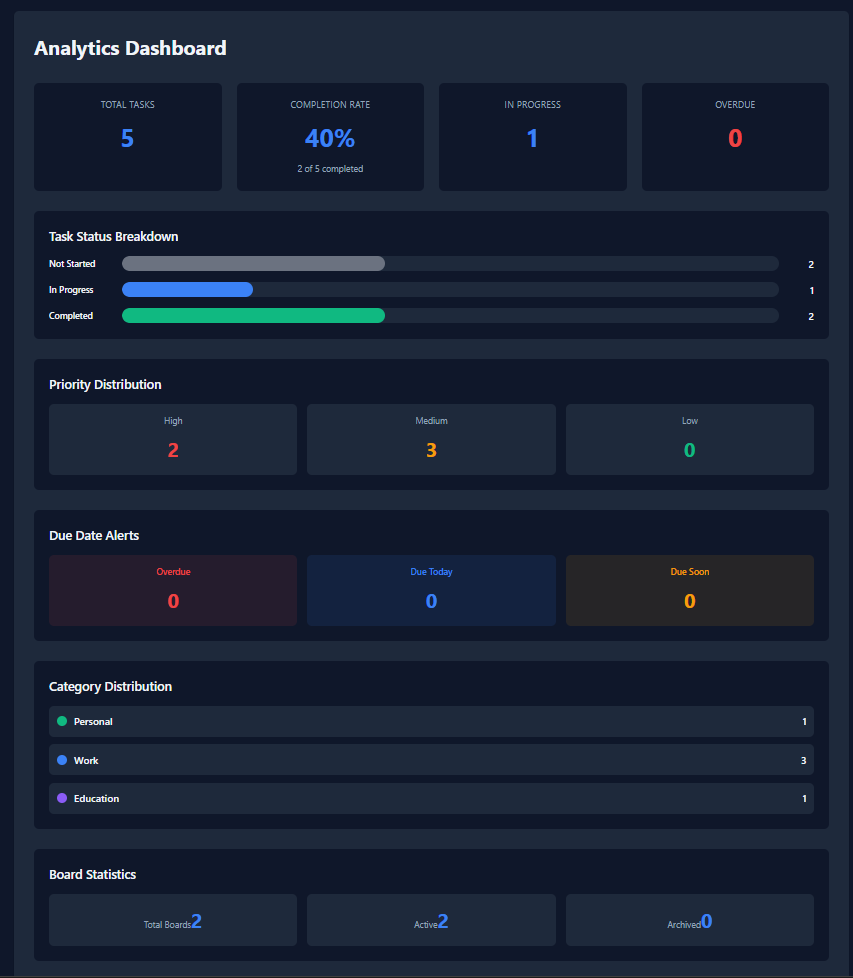
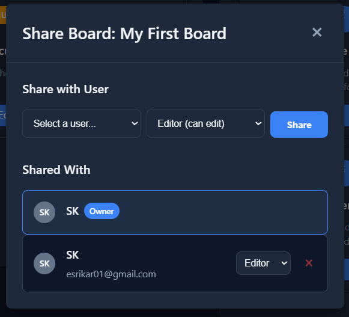

# Kanban Project Management App

A modern, full-featured Kanban board application built with React and Node.js for managing tasks and projects. Features a complete RESTful API backend, user authentication, real-time collaboration, and advanced project management capabilities.



## Table of Contents

- [Features](#features)
- [Screenshots](#screenshots)
- [Getting Started](#getting-started)
- [Project Structure](#project-structure)
- [Usage Guide](#usage-guide)
- [API Documentation](#api-documentation)
- [Technologies Used](#technologies-used)
- [Development](#development)
- [Production Deployment](#production-deployment)

## Features

### Core Functionality
- **Kanban Board**: Customizable columns with drag-and-drop task management
- **Task Management**: Full CRUD operations with rich task details
- **Multiple Boards**: Create and manage multiple project boards
- **Priority Levels**: High, Medium, Low priority with color-coded indicators
- **Categories**: Organize tasks by category (Work, Personal, Education, etc.)
- **Due Dates**: Set and track task deadlines with visual indicators
- **Search & Filter**: Advanced search with saved filters
- **Sort Options**: Sort tasks by priority, due date, title, or creation date

### Collaboration Features
- **User Authentication**: Secure JWT-based authentication system
- **Board Sharing**: Share boards with team members with permission levels (Owner/Editor/Viewer)
- **User Profiles**: Customizable user profiles with avatars
- **Task Assignment**: Assign tasks to team members
- **Activity Log**: Complete audit trail of all board activities
- **Notifications**: Real-time notifications for task assignments and updates

### Advanced Features
- **Multiple Views**: Kanban board, Calendar view, and Analytics dashboard
- **Automation Rules**: Create workflow automation rules for task management
- **Recurring Tasks**: Set up recurring task templates
- **Custom Fields**: Add custom fields to tasks for specialized data
- **Task Templates**: Quick task creation from predefined templates
- **Subtasks/Checklists**: Break down tasks into subtasks with progress tracking
- **Time Tracking**: Track estimated and actual time spent on tasks
- **Task Dependencies**: Link tasks to show dependencies
- **Bulk Operations**: Select and perform bulk actions on multiple tasks
- **Export/Import**: Export boards to JSON or CSV, import from JSON
- **Print View**: Print-friendly view of boards
- **Undo/Redo**: History management for task operations
- **Dark Mode**: Toggle between light and dark themes
- **Keyboard Shortcuts**: Power user keyboard shortcuts

### Production Features
- **Error Boundary**: React error boundary for graceful error handling
- **Loading States**: Loading spinners and skeletons for better UX
- **Environment Validation**: Automatic validation of environment variables
- **Comprehensive Error Handling**: User-friendly error messages

## Screenshots

### Sign In Page

Secure authentication with email and password. Switch between login and signup modes.

### Main Kanban Board

The main Kanban board view showing tasks organized in columns with drag-and-drop functionality, task cards with priority indicators, and board statistics sidebar.

### Task Creation

Comprehensive task creation form with all fields including title, description, priority, category, due date, assignment, subtasks, time tracking, and custom fields.

### Activity Log

Complete audit trail showing all activities on the board with user avatars, timestamps, and detailed action descriptions.

### Analytics Dashboard

Advanced analytics showing task statistics, completion rates, priority distribution, category breakdown, and time tracking metrics.

### Board Sharing Modal

Manage board sharing with team members, set permission levels, and view all shared users.

## Getting Started

### Prerequisites

- **Node.js**: Version 14 or higher
- **npm**: Version 6 or higher (comes with Node.js)
- **Git**: For cloning the repository

### Installation

1. **Clone the repository** (if applicable):
```bash
git clone <repository-url>
cd kanban-project-management
```

2. **Install frontend dependencies**:
```bash
npm install
```

3. **Install and initialize backend**:

**Option A: Using the batch file (Windows)**
```bash
.\init-backend.bat
```

**Option B: Using PowerShell script**
```bash
cd server
.\init.ps1
```

**Option C: Manual installation**
```bash
cd server
npm install
npm run init-db
```

4. **Start the application**:

**Start both frontend and backend together:**
```bash
npm run dev:full
```

**Or start them separately:**

Terminal 1 - Backend:
```bash
npm run server:dev
```

Terminal 2 - Frontend:
```bash
npm run dev
```

5. **Open your browser** and navigate to `http://localhost:5173`

### Environment Setup

The application uses environment variables for configuration. Create the following files:

**Root `.env` file** (optional, for frontend):
```env
VITE_API_URL=http://localhost:3001/api
```

**`server/.env` file** (required for backend):
```env
PORT=3001
JWT_SECRET=your-secret-key-change-in-production
DB_PATH=./data/kanban.db
CORS_ORIGIN=http://localhost:5173
NODE_ENV=development
```

> **Note**: In production, use a strong, randomly generated `JWT_SECRET` and update `CORS_ORIGIN` to your production domain.

### Building for Production

1. **Build the frontend**:
```bash
npm run build
```

The built files will be in the `dist` directory.

2. **Start the production server**:
```bash
cd server
npm start
```

3. **Serve the frontend**: Deploy the `dist` folder to your hosting service (Netlify, Vercel, etc.) or serve it with a static file server.

## Project Structure

```
kanban-project-management/
├── src/                          # Frontend source code
│   ├── components/              # React components
│   │   ├── ActivityLog.jsx     # Activity log modal
│   │   ├── AdvancedSearch.jsx  # Advanced search with saved filters
│   │   ├── AnalyticsDashboard.jsx # Analytics and reporting
│   │   ├── AutomationRules.jsx # Workflow automation management
│   │   ├── BoardForm.jsx       # Board creation/editing form
│   │   ├── BoardSharing.jsx    # Board sharing modal
│   │   ├── BoardStats.jsx      # Board statistics sidebar
│   │   ├── BoardSwitcher.jsx   # Board selection dropdown
│   │   ├── BulkActions.jsx     # Bulk operations toolbar
│   │   ├── CalendarView.jsx    # Calendar view of tasks
│   │   ├── Column.jsx          # Kanban column component
│   │   ├── CustomFields.jsx    # Custom field management
│   │   ├── ErrorBoundary.jsx   # React error boundary
│   │   ├── ExportImport.jsx   # Export/import functionality
│   │   ├── KanbanBoard.jsx     # Main Kanban board container
│   │   ├── KeyboardShortcuts.jsx # Keyboard shortcuts handler
│   │   ├── LoadingSkeleton.jsx # Loading skeleton component
│   │   ├── LoadingSpinner.jsx  # Loading spinner component
│   │   ├── LoginForm.jsx       # Authentication form
│   │   ├── NotificationButton.jsx # Notification button with badge
│   │   ├── NotificationsPanel.jsx # Notifications panel
│   │   ├── PrintView.jsx       # Print-friendly view
│   │   ├── RecurringTasks.jsx  # Recurring task management
│   │   ├── SearchFilterBar.jsx # Search and filter bar
│   │   ├── Task.jsx            # Individual task card
│   │   ├── TaskForm.jsx        # Task creation/editing modal
│   │   ├── ThemeToggle.jsx     # Dark mode toggle
│   │   ├── UserAvatar.jsx      # User avatar component
│   │   └── UserProfile.jsx     # User profile dropdown
│   ├── data/                    # Initial data
│   │   └── initialTasks.js     # Sample tasks
│   ├── services/                # API service layer
│   │   └── api.js              # Centralized API client
│   ├── styles/                  # CSS styles
│   │   └── App.css             # Main stylesheet
│   ├── utils/                   # Utility functions
│   │   ├── activityLog.js      # Activity logging utilities
│   │   ├── advancedSearch.js   # Advanced search logic
│   │   ├── automation.js       # Automation rule processing
│   │   ├── boardPermissions.js # Permission checking
│   │   ├── boardStorage.js     # Board storage utilities
│   │   ├── boardTemplates.js   # Board templates
│   │   ├── boardUtils.js       # Board utility functions
│   │   ├── categories.js      # Category management
│   │   ├── customFields.js     # Custom field utilities
│   │   ├── dateUtils.js        # Date formatting and utilities
│   │   ├── envValidation.js    # Environment validation
│   │   ├── exportImport.js     # Export/import utilities
│   │   ├── markdown.js         # Markdown parsing
│   │   ├── notifications.js    # Notification utilities
│   │   ├── recurringTasks.js   # Recurring task utilities
│   │   ├── storage.js          # Storage utilities
│   │   ├── taskDependencies.js # Task dependency management
│   │   ├── taskTemplates.js    # Task templates
│   │   ├── theme.js            # Theme management
│   │   ├── timeTracking.js     # Time tracking utilities
│   │   └── undoRedo.js         # Undo/redo history
│   ├── assets/                  # Static assets
│   │   ├── sign-in-page.png
│   │   ├── main kanban board.png
│   │   ├── task-creation.png
│   │   ├── activity-log.png
│   │   ├── analytics-dashboard.png
│   │   └── board-sharing-modal.png
│   ├── App.jsx                  # Main application component
│   └── main.jsx                 # Application entry point
├── server/                       # Backend server
│   ├── config/                  # Configuration files
│   │   └── database.js          # Database configuration and schema
│   ├── data/                    # Database files
│   │   └── kanban.db           # SQLite database (created on first run)
│   ├── middleware/              # Express middleware
│   │   ├── auth.js             # JWT authentication middleware
│   │   └── errorHandler.js     # Error handling middleware
│   ├── routes/                  # API routes
│   │   ├── activities.js       # Activity log endpoints
│   │   ├── auth.js             # Authentication endpoints
│   │   ├── automations.js      # Automation rules endpoints
│   │   ├── boards.js           # Board endpoints
│   │   ├── customFields.js     # Custom field endpoints
│   │   ├── filters.js           # Saved filter endpoints
│   │   ├── notifications.js    # Notification endpoints
│   │   ├── recurring.js        # Recurring task endpoints
│   │   ├── tasks.js             # Task endpoints
│   │   └── users.js             # User endpoints
│   ├── scripts/                 # Utility scripts
│   │   └── initDatabase.js     # Database initialization script
│   ├── utils/                   # Server utilities
│   │   └── envValidation.js     # Environment validation
│   ├── server.js                # Main server file
│   └── package.json             # Backend dependencies
├── dist/                         # Production build output
├── init-backend.bat              # Windows backend initialization script
├── package.json                  # Frontend dependencies and scripts
├── vite.config.js                # Vite configuration
└── README.md                     # This file
```

## Usage Guide

### Authentication

1. **Sign Up**: Click "Sign Up" on the login page to create a new account
2. **Sign In**: Enter your email and password to log in
3. **User Profile**: Click your avatar in the top right to access profile settings

### Board Management

- **Create Board**: Click the board switcher dropdown and select "Create New Board"
- **Switch Boards**: Use the board switcher in the header to switch between boards
- **Share Board**: Click the share icon to open the board sharing modal
- **Delete Board**: Access board options from the board switcher dropdown

### Task Management

- **Create Task**: Click the "+ Create Task" button in the header
- **Edit Task**: Click the "Edit" button on any task card
- **Delete Task**: Click the "Delete" button on any task card (confirmation required)
- **Move Task**: Drag and drop tasks between columns
- **Assign Task**: Select a user from the "Assign To" dropdown in the task form
- **Set Priority**: Choose High, Medium, or Low priority when creating/editing
- **Add Due Date**: Set a due date in the task form
- **Add Subtasks**: Click "Add Subtask" in the task form to create a checklist

### Advanced Features

- **Search**: Use the search bar to find tasks by title or description
- **Filter**: Use the filter dropdowns to filter by category or priority
- **Sort**: Use the sort dropdown to sort tasks by different criteria
- **Bulk Actions**: Select multiple tasks using checkboxes, then use bulk action buttons
- **Keyboard Shortcuts**: Press `?` to view available keyboard shortcuts
- **Export/Import**: Access export/import options from the header menu
- **Print View**: Click the print icon to view a print-friendly version
- **Activity Log**: Click the activity log icon to view board history
- **Analytics**: Switch to Analytics view to see board statistics
- **Calendar View**: Switch to Calendar view to see tasks on a calendar
- **Automation Rules**: Access automation rules from the header menu
- **Recurring Tasks**: Set up recurring task templates from the header menu
- **Custom Fields**: Add custom fields to tasks from the header menu
- **Dark Mode**: Toggle dark mode using the theme toggle button

## API Documentation

The backend provides a RESTful API. All endpoints (except authentication) require a JWT token in the Authorization header:

```
Authorization: Bearer <token>
```

### Authentication Endpoints

- `POST /api/auth/register` - Register a new user
  - Body: `{ name, email, password }`
  - Returns: `{ user, token }`

- `POST /api/auth/login` - Login user
  - Body: `{ email, password }`
  - Returns: `{ user, token }`

### Board Endpoints

- `GET /api/boards` - Get all accessible boards (owned and shared)
- `GET /api/boards/:id` - Get board by ID
- `POST /api/boards` - Create new board
- `PUT /api/boards/:id` - Update board
- `DELETE /api/boards/:id` - Delete board
- `POST /api/boards/:id/share` - Share board with user
- `DELETE /api/boards/:id/share/:userId` - Remove board sharing

### Task Endpoints

- `GET /api/tasks?boardId=xxx` - Get tasks for a board
- `GET /api/tasks/:id` - Get task by ID
- `POST /api/tasks` - Create new task
- `PUT /api/tasks/:id` - Update task
- `DELETE /api/tasks/:id` - Delete task

### Other Endpoints

See `server/README.md` for complete API documentation including:
- User management endpoints
- Activity log endpoints
- Notification endpoints
- Automation rule endpoints
- Recurring task endpoints
- Saved filter endpoints
- Custom field endpoints

## Technologies Used

### Frontend
- **React 18** - UI library
- **Vite** - Build tool and dev server
- **@hello-pangea/dnd** - Drag and drop functionality
- **CSS3** - Styling with CSS variables for theming

### Backend
- **Node.js** - Runtime environment
- **Express.js** - Web framework
- **SQLite3** - Database
- **JWT (jsonwebtoken)** - Authentication
- **bcryptjs** - Password hashing
- **express-validator** - Input validation
- **CORS** - Cross-origin resource sharing
- **dotenv** - Environment variable management

## Development

### Available Scripts

**Frontend:**
- `npm run dev` - Start development server
- `npm run build` - Build for production
- `npm run preview` - Preview production build

**Backend:**
- `npm run server:dev` - Start backend in development mode with auto-reload
- `npm run server` - Start backend in production mode
- `npm run server:init` - Install backend dependencies and initialize database

**Both:**
- `npm run dev:full` - Start both frontend and backend together

### Development Workflow

1. Make changes to the code
2. Frontend: Changes are hot-reloaded automatically
3. Backend: Server restarts automatically with `--watch` flag
4. Test changes in the browser
5. Commit changes to git

### Code Structure

- **Components**: Reusable React components in `src/components/`
- **Utils**: Utility functions in `src/utils/`
- **Services**: API service layer in `src/services/`
- **Routes**: API routes in `server/routes/`
- **Middleware**: Express middleware in `server/middleware/`

## Production Deployment

### Frontend Deployment

1. Build the application:
```bash
npm run build
```

2. Deploy the `dist` folder to your hosting service:
   - **Netlify**: Drag and drop the `dist` folder
   - **Vercel**: Connect your repo and set build command to `npm run build`
   - **GitHub Pages**: Use GitHub Actions to deploy
   - **Traditional hosting**: Upload `dist` folder contents to your web server

3. Set environment variable `VITE_API_URL` to your backend URL

### Backend Deployment

1. Set up a Node.js hosting service (Heroku, Railway, DigitalOcean, etc.)

2. Set environment variables:
   - `PORT` - Server port (usually set by hosting service)
   - `JWT_SECRET` - Strong random secret key
   - `DB_PATH` - Database file path
   - `CORS_ORIGIN` - Your frontend URL
   - `NODE_ENV=production`

3. Deploy the `server` folder

4. The database will be created automatically on first run

### Database Migration

For production, consider migrating from SQLite to PostgreSQL:
1. Update `server/config/database.js` to use PostgreSQL
2. Update connection string in environment variables
3. Run database migrations

## Contributing

1. Fork the repository
2. Create a feature branch (`git checkout -b feature/amazing-feature`)
3. Commit your changes (`git commit -m 'Add some amazing feature'`)
4. Push to the branch (`git push origin feature/amazing-feature`)
5. Open a Pull Request

## License

This project is open source and available under the MIT License.

## Support

For issues, questions, or contributions, please open an issue on the GitHub repository.

---

**Built with ❤️ using React and Node.js**
